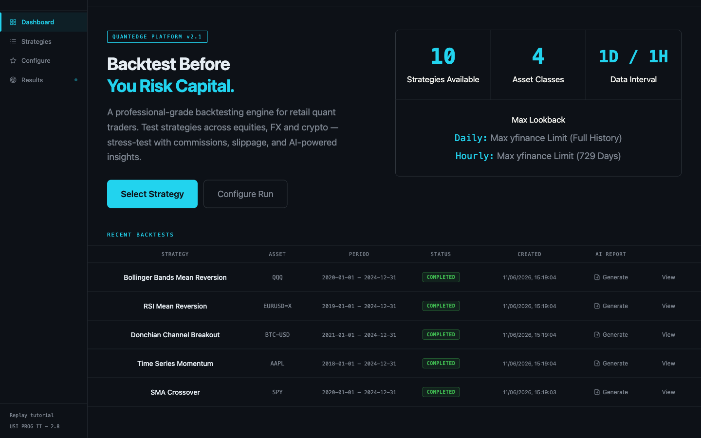
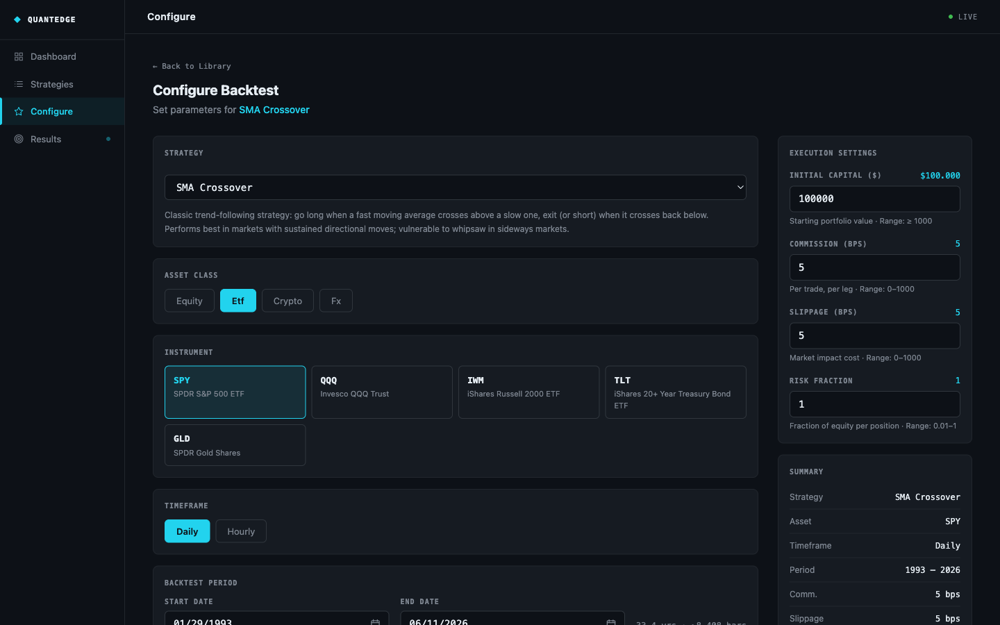
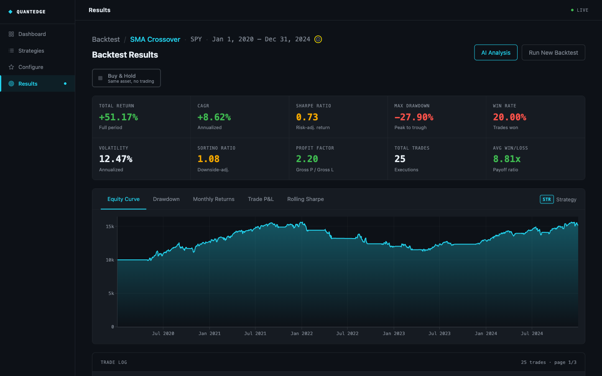
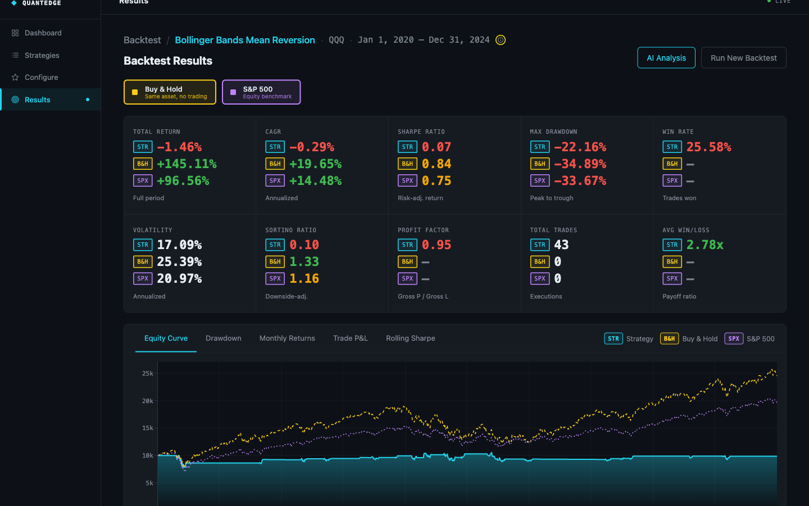
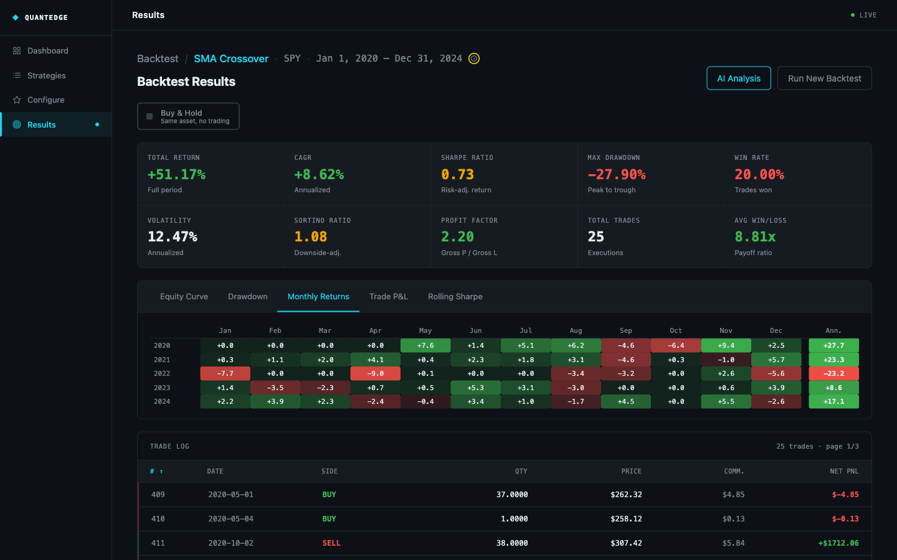
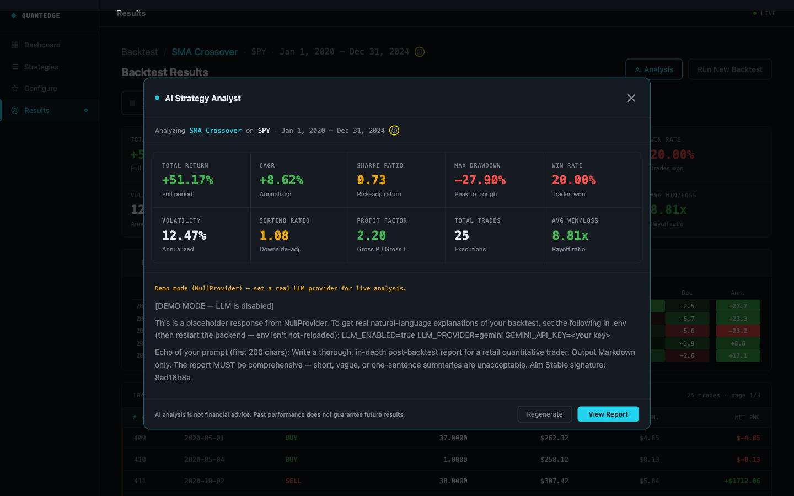

# QuantBacktest — User Guide

This guide is for **end users** of the QuantBacktest web app — retail traders, students, anyone evaluating a trading strategy on historical data. If you are looking to *contribute code*, read [`CONTRIBUTING.md`](../CONTRIBUTING.md) instead; if you are looking for the *system architecture*, read [`../ARCHITECTURE.md`](../ARCHITECTURE.md).

The walkthrough assumes you have run the [Quick Start in `README.md`](../README.md#quick-start) and have both the backend (`uvicorn`, port 8000) and the frontend (`npm run dev`, port 5173) running locally. If not, do that first.

---

## Table of contents

1. [Your first backtest in five minutes](#1-your-first-backtest-in-five-minutes)
2. [Screenshots](#2-screenshots)
3. [Picking a strategy](#3-picking-a-strategy)
4. [Configuring parameters](#4-configuring-parameters)
5. [Picking an asset and a timeframe](#5-picking-an-asset-and-a-timeframe)
6. [Reading the charts](#6-reading-the-charts)
7. [Reading the KPI panel](#7-reading-the-kpi-panel)
8. [AI report and PDF export](#8-ai-report-and-pdf-export)
9. [Troubleshooting](#9-troubleshooting)

---

## 1. Your first backtest in five minutes

Goal: run **SMA Crossover on SPY (S&P 500 ETF) from 2020-01-01 to 2024-12-31, daily bars**, and see a PnL chart at the end.

1. **Confirm both servers are up.** In two terminals:

   ```bash
   # Terminal 1 — backend
   uvicorn backend.main:app --reload
   # → Uvicorn running on http://127.0.0.1:8000

   # Terminal 2 — frontend
   cd frontend && npm run dev
   # → Local: http://localhost:5173
   ```

2. **Open the app.** Browse to <http://localhost:5173>. You will land on the **Dashboard**.

3. **Click "New Backtest"** in the sidebar.

4. **Pick the asset.** In the *Asset* dropdown, type `SPY` and select it. SPY is one of the seeded ETFs (see [`data-sources.md`](data-sources.md)).

5. **Pick the timeframe.** Leave it on **Daily (`1d`)** for your first run — daily data covers more history and is more forgiving of misconfiguration than hourly.

6. **Pick the strategy.** In the *Strategy* dropdown, select **SMA Crossover**. The parameter form below it updates automatically — that form is auto-generated from the Pydantic config class on the strategy (`fast_window`, `slow_window`, `allow_short`).

7. **Leave the parameters at their defaults** (`fast_window=20`, `slow_window=50`, `allow_short=false`). These are the classic 20-day / 50-day SMA crossover.

8. **Set the date range** to 2020-01-01 → 2024-12-31. The date picker is capped at the available daily history for the asset.

9. **Leave the execution settings at their defaults** for now: starting cash $10,000, commission 5 bps (= 0.05% per leg), slippage 2 bps, position sizing "fixed fraction" at 100%. These are the defaults from `.env.example` and they reflect realistic retail-broker frictions.

10. **Click "Run Backtest"**. The button switches to a loading state while the backend runs `BacktestAgent.run(...)` synchronously. A run on five years of daily SPY data with SMA Crossover typically completes in well under a second on a laptop.

11. **You land on the Results page.** It shows:
    - An **equity curve** at the top, with two benchmark overlays toggleable from the legend (same-asset buy-and-hold and SPY buy-and-hold — both of which are this asset in this case, so they coincide).
    - A **drawdown curve** below it.
    - A **monthly returns heatmap**.
    - A **trade-P&L scatter** and a **rolling Sharpe** chart in the secondary panel.
    - A **metrics grid** on the right with three categories: return, risk, trade.
    - An **AI report card** at the bottom (in demo mode by default — see [§8](#8-ai-report-and-pdf-export)).

You have just executed a real event-driven backtest with realistic frictions. The rest of this guide is about getting more out of subsequent runs.

---

## 2. Screenshots

> 🛠️ TODO(team): drop real screenshots into `docs/images/` and replace the placeholders below.

-  — *TODO(team): screenshot of the Dashboard listing five recent runs.*
-  — *TODO(team): screenshot of the configuration form with SPY + SMA Crossover selected.*
-  — *TODO(team): screenshot of the Results page top-half — equity curve + metrics grid.*
-  — *TODO(team): screenshot showing the shared legend with strategy / same-asset B&H / SPY B&H lines toggled.*
-  — *TODO(team): screenshot of the monthly returns heatmap.*
-  — *TODO(team): screenshot of the LLM-generated report, with the "demo mode" badge visible.*

The `images/` folder is created lazily; you can add it under `docs/images/` and the relative paths above will resolve.

---

## 3. Picking a strategy

QuantBacktest ships **11 strategies** organised into five families. The full catalogue with math, parameters, citations, and "wins in / loses in" lives in [`strategies.md`](strategies.md). The short version:

| Strategy (slug) | Family | When it tends to work | When it tends to bleed |
|---|---|---|---|
| **SMA Crossover** (`sma-crossover`) | Trend | Sustained bull or bear moves | Sideways chop (whipsaws) |
| **MACD Crossover** (`macd-crossover`) | Trend (momentum-aware) | Trending markets with persistent momentum | Mean-reverting chop |
| **Ichimoku Cloud** (`ichimoku-cloud`) | Trend (multi-component) | Sustained directional regimes | Range-bound markets with a thin cloud |
| **Time Series Momentum** (`time-series-momentum`) | Momentum | Medium-horizon (1–12 month) trend persistence | Sharp reversals |
| **Donchian Breakout** (`donchian-breakout`) | Breakout (Turtle) | Trending markets with clean breakouts | Ranges with false breakouts |
| **Keltner Channels** (`keltner-channels`) | Volatility envelope | *Breakout* mode: trends. *Mean-reversion* mode: ranges | Wrong-regime configuration; whipsaws when bands are too tight |
| **Bollinger Bands** (`bollinger-bands`) | Mean reversion | Ranges with stable volatility | Trends where price walks the band |
| **CCI** (`cci`) | Mean reversion | Range-bound markets that respect ±100 thresholds | Strong trends pinning CCI beyond ±100 |
| **RSI Mean Reversion** (`rsi-mean-reversion`) | Mean reversion | Range-bound markets | Strong trends (keeps fading the move) |
| **Stochastic Oscillator** (`stochastic-oscillator`) | Mean reversion | Range-bound markets that respect Lane's bands | Trends saturating %K near 0 or 100 |
| **Buy & Hold** (`buy-and-hold`) | Benchmark | Any sustained bull market | Drawdowns (by construction, never exits) |

**Rules of thumb for choosing**:

- If you are **new to backtesting**, start with SMA Crossover or RSI Mean Reversion. Both have intuitive parameters and produce easy-to-read equity curves.
- If you are **comparing your active strategy to a baseline**, also run Buy & Hold for the same asset and window. The Results page also automatically overlays buy-and-hold of the same asset and SPY on every equity chart for context.
- **Never** tune parameters by repeatedly running the full backtest. That is the canonical recipe for overfitting (López de Prado, 2018, ch. 7). The Strategy Agent exposes a walk-forward split for proper out-of-sample evaluation.

---

## 4. Configuring parameters

The parameter form on the *New Backtest* page is **auto-generated** from the strategy's Pydantic `Config` class. The frontend reads the JSON Schema returned by `GET /strategies` and renders an input per field, respecting `default`, `minimum`, `maximum`, and field descriptions.

**Worked example — SMA Crossover**:

| Field | Default | Range | What it does |
|---|---|---|---|
| `fast_window` | 20 | 2–200 | Fast SMA lookback in *bars* (not days — daily and hourly are both supported). |
| `slow_window` | 50 | 5–500 | Slow SMA lookback. Must exceed `fast_window`. |
| `allow_short` | `false` | — | If true, the strategy goes short when fast < slow instead of going flat. |

A few notes that apply to every strategy:

- **All lookbacks are in *bars*.** A 252-bar lookback is one trading year *on daily bars*; on hourly bars it is roughly 36 NYSE sessions. Strategies are frequency-agnostic; the engine handles annualisation downstream.
- **`allow_short` matters more than it looks.** Many strategies double their trade count when shorting is enabled, but doubling the number of trades does not double the edge — it doubles the commission and slippage paid. Try it both ways.
- **The form blocks submission if any field is out of range.** Backend validation (Pydantic) is the source of truth; the frontend form mirrors the same rules so you get instant feedback.

For the per-strategy parameter catalogue with math and citations, see [`strategies.md`](strategies.md).

---

## 5. Picking an asset and a timeframe

### Asset universe

The default universe is seeded by `scripts/init_db.py` (run once after `init_db.py`). It contains:

- **20 US mega-cap equities** — AAPL, NVDA, MSFT, TSLA, JPM, … (see [`data-sources.md`](data-sources.md) for the full list).
- **5 ETFs** — SPY, QQQ, IWM, TLT, GLD.
- **5 crypto pairs** — BTC-USD, ETH-USD, BNB-USD, XRP-USD, SOL-USD.
- **6 FX pairs** — EURUSD, GBPUSD, USDCHF, EURCHF, EURGBP, GBPCHF.

To add an asset, edit `scripts/init_db.py`'s seed list and re-run `python scripts/init_db.py` (it is idempotent) followed by `python scripts/load_initial_data.py --timeframes 1d 1h` to fetch the data.

### Timeframe choice

| Timeframe | Bars per year (equity / FX / crypto) | History horizon | Best for |
|---|---|---|---|
| **Daily (`1d`)** | 252 / 260 / 365 | Full available history (decades for equities) | First runs, multi-year regimes, low compute |
| **Hourly (`1h`)** | 1638 / 6240 / 8760 | **~730 days max** (yfinance limit) | Strategies that exploit intraday structure |

The hourly cap is a hard constraint of Yahoo Finance, our primary data source. The frontend's date picker is capped at 730 days back for hourly to keep you out of the "no data" trap. For longer crypto-hourly windows, the `CryptoFetcher` can fall back to Binance via `ccxt` — but the frontend currently only exercises this when you re-fetch via `POST /assets/{symbol}/refresh?timeframe=1h`.

Per-asset-class **native trading calendars** are used everywhere — NYSE (XNYS) for equities and ETFs, a bespoke 24×5 window for FX (Sunday 22:00 UTC → Friday 22:00 UTC), 24×7 for crypto. The Sharpe / Sortino / CAGR annualisation factor adjusts automatically based on `(asset_class, timeframe)`. See [`calendars.md`](calendars.md) for the table.

---

## 6. Reading the charts

The Results page renders five chart kinds, each built by `backend/analytics/visualizations.py` on the server and returned as a Plotly figure dict. All charts share a **crosshair tooltip** — hovering anywhere on the timeline highlights the same x-coordinate on every chart — and a **shared legend** that toggles benchmark overlays.

### 6.1 Equity curve

- The strategy's mark-to-market portfolio equity bar-by-bar.
- The **same-asset buy-and-hold** overlay shows what holding the asset over the same window would have produced — the natural baseline.
- The **SPY buy-and-hold** overlay shows the broader-market reference.
- **What to look for:** straight-line growth (good); long flat periods (the strategy was flat or whipsawing); periods where the strategy *under*-performs buy-and-hold (often the cost of the strategy's flat periods plus commissions/slippage).
- **Common pitfall:** a beautiful curve on five years of one asset proves nothing. Run the same strategy on three or four assets and compare.

### 6.2 Drawdown curve

- The percentage drop from the rolling peak equity: $D_t = (V_t - \max_{s \le t} V_s) / \max_{s \le t} V_s$.
- **What to look for:** the trough (max drawdown) and the time spent under water. A 30% drawdown that recovers in three months is very different from a 15% drawdown that takes two years to recover.
- **Common pitfall:** a backtested 20% max drawdown will almost always understate the live experience — partly because of regime changes, partly because of survivorship bias in the data source. Plan for *worse* than what the backtest shows. The README's retail-trader tip: *"if your backtested Max Drawdown is 20%, prepare for a 30% drawdown in live trading."*

### 6.3 Monthly returns heatmap

- One cell per month-year, coloured by return.
- **What to look for:** clusters of red months (regime sensitivity), seasonality (e.g. summer chop), the consistency of green vs the magnitude of any single red.
- **Common pitfall:** a strategy with one huge green month and twelve small reds can show a strong Sharpe by luck; the heatmap exposes this where the equity curve hides it.

### 6.4 Trade P&L scatter

- One point per trade leg, with x = entry timestamp, y = net P&L.
- **What to look for:** clustering (do most trades cluster around break-even with one or two outliers?), asymmetry (are there many small wins and a few big losses, or the reverse?).
- **Common pitfall:** trade count matters. Twenty trades cannot reliably distinguish a real edge from noise; aim for ≥ 100 trades for a meaningful read.

### 6.5 Rolling Sharpe

- Rolling-window Sharpe ratio (default 252-bar window on daily, scaled accordingly on hourly).
- **What to look for:** stability. A strategy whose rolling Sharpe oscillates wildly between +2 and −2 is regime-dependent and unlikely to survive the next regime change.
- **Common pitfall:** a rolling Sharpe near the start of the run is computed from a half-empty window — interpret it cautiously.

---

## 7. Reading the KPI panel

The metrics grid on the right of the Results page groups KPIs into three categories. Formulas live in [`../CITATIONS.md`](../CITATIONS.md#section-c--algorithms--formulas) and in the academic methodology section ([`academic/03_methodology.tex`](academic/03_methodology.tex)).

### 7.1 Return metrics

| KPI | What it tells you |
|---|---|
| **Total return** | $V_T / V_0 - 1$. The raw percentage your equity grew (or shrank). |
| **CAGR** | The compound annual growth rate — `Total return` converted to a per-year figure. Comparable across different run lengths. |
| **Annualised return** | The annualised arithmetic mean of per-bar returns, scaled by the per-asset annualisation factor $k$. Used as the numerator of Sharpe. |

### 7.2 Risk metrics

| KPI | What it tells you |
|---|---|
| **Annualised volatility** | $\sqrt{k} \cdot \mathrm{std}(r_t)$. The same $k$ used for the Sharpe numerator. |
| **Sharpe ratio** | Annualised return / annualised volatility (assuming zero risk-free rate). Rule of thumb: > 1 is interesting, > 2 is suspicious, > 3 means re-check for look-ahead bias. |
| **Sortino ratio** | Like Sharpe but the denominator is the downside semi-deviation only. Use when the return distribution is asymmetric — Sortino rewards upside variance, Sharpe penalises it. |
| **Maximum drawdown** | The worst peak-to-trough decline, as a negative percentage. |
| **Calmar ratio** | CAGR / |max drawdown|. A pain-adjusted return metric — how much annual growth you got per unit of drawdown you had to live through. |

### 7.3 Trade metrics

| KPI | What it tells you |
|---|---|
| **Trade count** | The number of executed legs. Below ~30 trades, the other trade metrics are statistically noisy. |
| **Win rate** | Fraction of trades with positive net P&L. By itself, a win rate ≥ 50% means very little — a strategy with 90% wins but tiny average win and one huge average loss can be unprofitable. |
| **Profit factor** | $\sum \mathrm{wins} / \sum |\mathrm{losses}|$. Profit factor > 1 is profitable; > 1.5 is good; > 2 is very good. |
| **Average win / average loss** | Per-leg means. The ratio matters more than the absolute values. |
| **Expectancy** | $\mathrm{winrate} \cdot \overline{\mathrm{win}} - (1 - \mathrm{winrate}) \cdot \overline{\mathrm{loss}}$. The expected P&L per trade. Multiply by your trade frequency to estimate annual return contribution. |

For the **benchmark overlays**, the same KPI panel is computed against the benchmark equity curve via `GET /backtests/{run_id}/benchmark/{kind}/metrics`. The trade block is zeroed for benchmarks (buy-and-hold has only one entry and one exit, so trade statistics aren't meaningful).

---

## 8. AI report and PDF export

### Demo mode (the default)

Out of the box, [`backend/config.py`](../backend/config.py) sets `LLM_ENABLED=false`. The Explanation Agent then uses `NullProvider`, which returns deterministic canned text. The AI Report card on the Results page renders with a **"demo mode"** badge so you cannot mistake the canned text for a real LLM response.

This is intentional — it keeps the test suite deterministic, keeps tutorial setup free of API-key requirements, and avoids quietly calling an LLM in CI.

### Live mode (opt-in)

To get a real LLM-generated report:

1. Get a Google AI Studio API key (free tier suffices for evaluation): <https://aistudio.google.com/app/apikey>.
2. Edit `.env`:
   ```ini
   LLM_ENABLED=true
   LLM_PROVIDER=gemini
   GEMINI_API_KEY=AIza...your-key-here
   LLM_MODEL=gemini-3.5-flash        # or another Gemini model you have access to
   ```
3. Restart the backend (`uvicorn` will pick up the new env vars).
4. On the Results page, click **"Generate report"** on the AI Report card. The "demo mode" badge disappears and a real Gemini-generated report appears, grounded on the run's metrics, trades, and equity curve.

The report is **cached per run** in the `llm_conversations` table. The Results page's "Regenerate" button is a `POST` (it triggers a fresh call); the initial card render is a `GET` (it returns the cached version if any).

### PDF export

On the AI Report card, click **"Download PDF"**. The browser-side [`jsPDF`](https://github.com/parallax/jsPDF) library renders the report (plus the page-header context — strategy, asset, window) into a single-page PDF and triggers a download. No backend round-trip is involved; this works in demo mode too.

---

## 9. Troubleshooting

| Symptom | Likely cause | Fix |
|---|---|---|
| **"No data for asset"** on submit | The asset's bars are not loaded in the local DB yet. | Run `python scripts/load_initial_data.py --timeframes 1d 1h` to fetch the seeded universe, or `POST /assets/{symbol}/refresh?timeframe=1d` for a single symbol. |
| **Slow page loads** on the Results page | Hourly runs with thousands of bars are larger payloads than daily. | Default to daily for first runs; switch to hourly only when the strategy needs intraday signals. |
| **Strategy dropdown is empty** | Backend not running or `STRATEGY_REGISTRY` import failed at startup. | Check `uvicorn` logs for an `ImportError`; confirm `backend/strategies/__init__.py` lists every strategy module. |
| **AI report errors with "LLM not enabled"** | `LLM_ENABLED=false` in `.env`, or `GEMINI_API_KEY` empty. | Set both correctly (see [§8](#8-ai-report-and-pdf-export)) and restart the backend. |
| **AI report errors with "Rate limit exceeded"** | Google AI free tier per-minute quota hit. | Wait 60 seconds and click "Regenerate", or upgrade your AI Studio plan. |
| **Frontend shows "Network error" on submit** | Vite dev server cannot reach the backend (proxy 502). | Check the backend is on port 8000; verify `FRONTEND_API_URL` in `.env` matches. |
| **Backtest dates greyed-out for hourly** | Hourly data is capped at ~730 days back by yfinance. | Either pick a more recent window, or use daily, or extend the date range via `POST /assets/{symbol}/refresh` with `timeframe=1h` (the `CryptoFetcher` can reach further via Binance fallback). |
| **Sharpe ratio looks impossibly high** | Likely a look-ahead-bias regression in a custom strategy. | Run `pytest tests/test_engine_no_lookahead.py` — if it passes, the engine is clean and the bias is in the strategy. Review `generate_signals` for use of `bars.iloc[t+1]` or similar future-leak patterns. |
| **`pytest` fails with `database is locked`** | A lingering uvicorn process is holding `quantbacktest.db`. | Stop uvicorn (`Ctrl-C`) then re-run `pytest`. |
| **`make pdf` in `docs/academic/` errors** | A LaTeX package is missing. | Run `tlmgr install <package-name>` for the missing one. Common ones: `todonotes`, `csquotes`, `biblatex`. |

For anything not covered here, open a GitHub Issue (see [`../CONTRIBUTING.md`](../CONTRIBUTING.md#asking-for-help)).

---

_Last verified against code: 2026-05-24._
